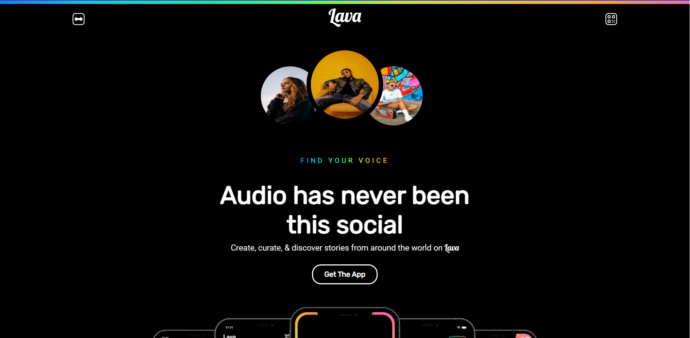

# Lava App Landing Page Replica

🚀 Welcome to the stunning React-powered replica of the Lava app landing page!

## Overview

This project is a reimagining of the Lava app landing page using React. It aims to capture the essence of the original design while incorporating modern web development practices.

## Features

- **Responsive Design:** Ensures a seamless experience across various devices and screen sizes.Currently adding the final details to enhance the overall user experience.
- **React Components:** Utilizes modular React components for a maintainable and organized codebase.

## Sneak Peek

## Live Demo

Check out the live demo [here](https://lava-landingpage.vercel.app/).

## How to Run

1. Clone the repository:

   git clone https://github.com/KINDREW/lava_landingpage.git

2. Install dependencies:
   npm install

3. Start the development server
   npm start
